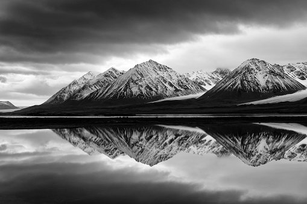

# paint_BW_images
by: Mika Yosef

 

Make your black&white pictue a colorful one.

By using neural network, with a net of 11 layers of convolution, the model learn the main elements and success to paint the picture in a good way.

The model trained on a small dataset of 50K images with a low resolution (32x32) that categorized into 10 classes.

In the notebook you can see that the model work on any size of a picture, and success to paint objects that do not appear in the dataset (for example you can check the football field and the hippo examples).
